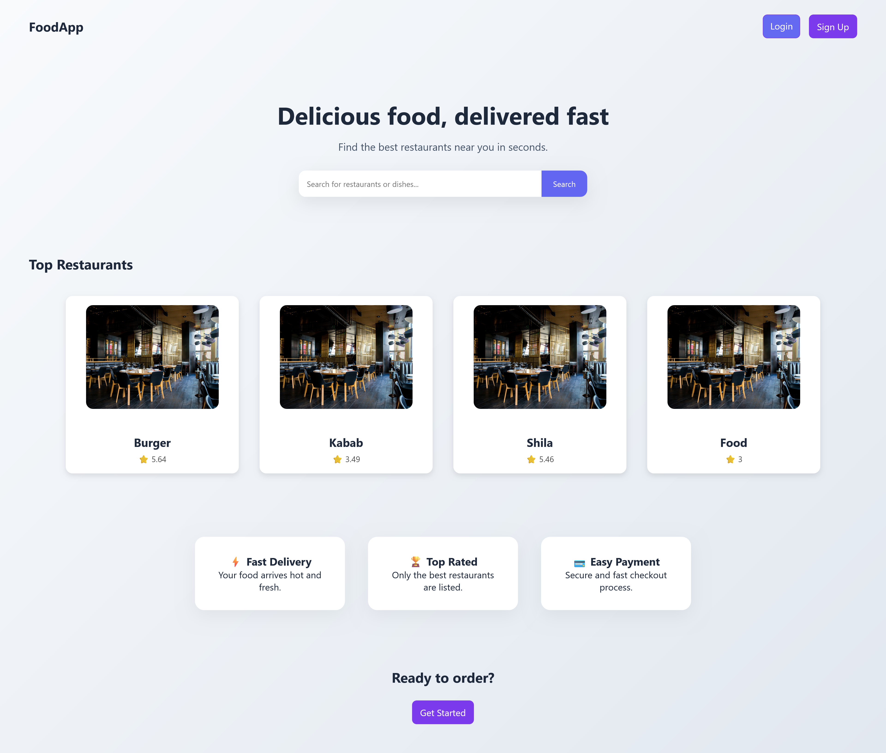
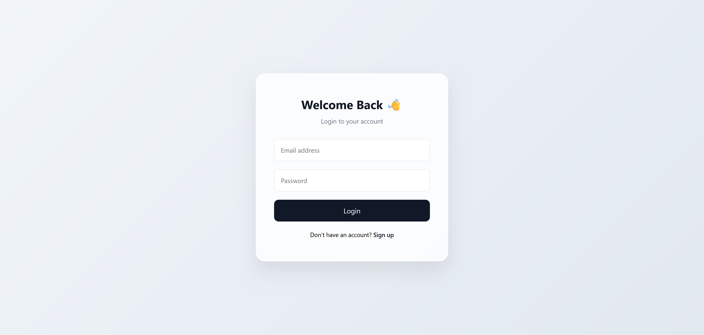
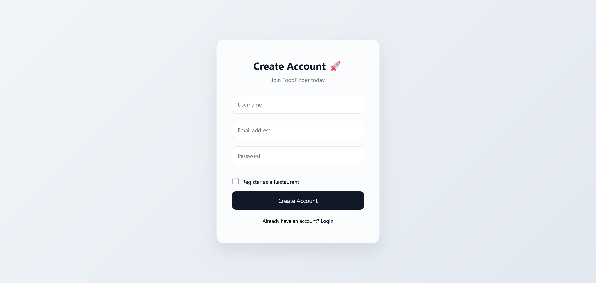
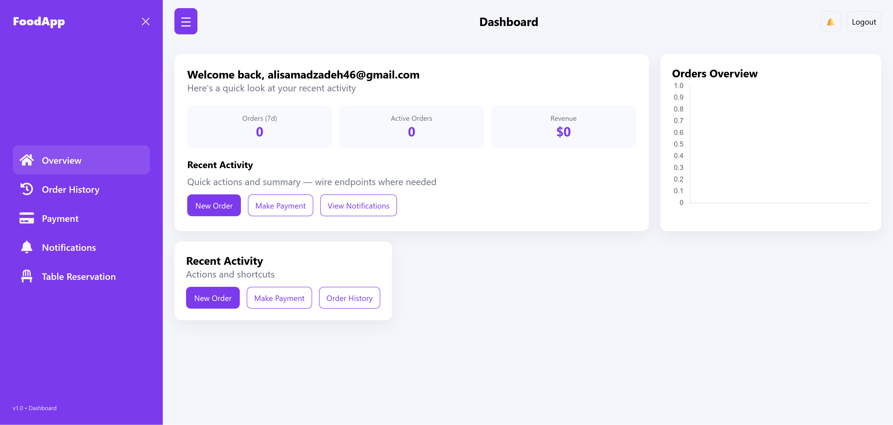
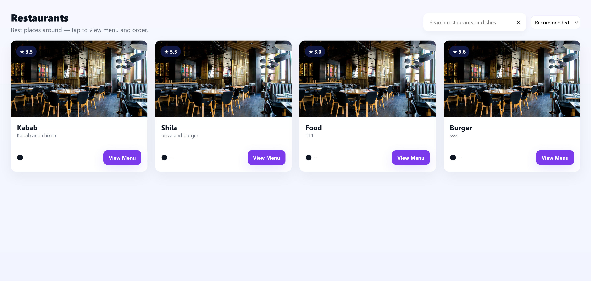

 How to run the whole stack (Django, Celery, Docker, Frontend)

This README explains step-by-step how to run the full project locally and with Docker: backend (Django + DRF + JWT), Celery (worker + optionally beat), message broker (Redis), database (Postgres or SQLite), and frontend (React / Vite). Follow the section that matches how you want to run it (Docker recommended).


## 📸 Screenshots

> Screenshots are located in the `backend/screenshots/` folder.

### Home Page (Guest)


### Login


### Register


### Dashboard



### Resturant



### Order food


Quick overview

Backend: Django + Django REST Framework, JWT auth (SimpleJWT)

Background tasks: Celery (Redis broker)

Database: Postgres recommended (SQLite OK for quick dev)

Frontend: React (Vite) — dev server or built static files

Dev network: 
```bash
backend default http://127.0.0.1:8000,
frontend dev http://localhost:5173
```

Prerequisites

Git

Python 3.10+ and venv (if running backend locally)

Node 16+ (for frontend) and npm / pnpm / yarn

Docker & Docker Compose (recommended)

Redis (if running Celery locally) or let Docker provide it

Postgres (recommended) or SQLite


Environment variables (example)

Create a .env in the repo root or in backend/ depending on your layout. Typical variables:
```bash
# Django / DB
DJANGO_SECRET_KEY=your-secret-key
DJANGO_DEBUG=True

POSTGRES_DB=food_db
POSTGRES_USER=food_user
POSTGRES_PASSWORD=food_pass
POSTGRES_HOST=db
POSTGRES_PORT=5432

# SimpleJWT
SIMPLE_JWT_ACCESS_TOKEN_LIFETIME=5m
SIMPLE_JWT_REFRESH_TOKEN_LIFETIME=1d

# Django channels (if using)
REDIS_URL=redis://redis:6379/0

# Other
ALLOWED_HOSTS=127.0.0.1,localhost
CORS_ALLOWED_ORIGINS=http://localhost:5173
```
Adjust names/values to your project.

Option A — Run entire stack with Docker (recommended)

1. Build & start
From repo root (where docker-compose.yml lives):
```Bash
# with modern docker-compose plugin
docker compose up --build
# or older
docker-compose up --build
```
This normally starts services:
db (Postgres)
redis
backend / web (Django)
celery or celery-worker
frontend (optional build or dev server)

2. Run migrations, create superuser (inside the backend container)
```bash
# run commands inside backend container (service may be named `backend` or `web`)
docker compose exec backend python manage.py migrate
docker compose exec backend python manage.py createsuperuser
# collect static (if you plan to serve static from a container or nginx)
docker compose exec backend python manage.py collectstatic --noinput
```

3. Start/inspect Celery worker & beat
If your compose defines celery or celery-worker, it usually starts automatically with docker compose up. If not:
```Bash
# run a worker (inside container or service)
docker compose exec backend celery -A config worker --loglevel=info
# or if you have a separate celery service
docker compose exec celery-worker /bin/sh -c "celery -A config worker --loglevel=info"
# run beat (if used)
docker compose exec celery-beat celery -A config beat --loglevel=info
```

4. Frontend
If compose starts frontend dev server, open http://localhost:5173.
If frontend is built into static assets, build using:
```Bash

# inside frontend folder (on host) or using docker
npm install
npm run build
```
# optionally copy build to backend static or serve via Nginx / Vite preview
Option B — Run services locally (no Docker)
Backend (local Python venv)
```Bash
# create venv
python -m venv .venv
source .venv/bin/activate     # macOS / Linux
.venv\Scripts\activate        # Windows PowerShell

pip install -r backend/requirements.txt
```
# ensure rest_framework, simplejwt, django-cors-headers, celery, redis, Pillow etc are installed
Set .env or environment variables, then:

```Bash
cd backend
python manage.py migrate
python manage.py createsuperuser
python manage.py runserver 0.0.0.0:8000
```
Make sure settings.py allows CORS for your frontend:

```bash
# settings.py
INSTALLED_APPS += ["corsheaders"]
MIDDLEWARE = ["corsheaders.middleware.CorsMiddleware"] + MIDDLEWARE
CORS_ALLOWED_ORIGINS = ["http://localhost:5173"]
```
Redis & Celery (local)
Install Redis (or run via Docker):
```Bash
# macOS (homebrew)
brew install redis
brew services start redis

# or with Docker
docker run -d --name redis -p 6379:6379 redis
```
Start Celery worker from backend folder:
```Bash
celery -A config worker --loglevel=info
# if you need beat
celery -A config beat --loglevel=info
-A config
```
Frontend (local)
```bash
cd frontend
npm install
npm run dev          # runs Vite dev server on :5173 by default
# or build for production
npm run build
npm run preview      # optional preview of built assets

```

Important Django steps
Ensure MEDIA_URL and MEDIA_ROOT are set and served during development:
```bash
# settings.py
MEDIA_URL = "/media/"
```
In project/urls.py:
```bash
from django.conf import settings
from django.conf.urls.static import static

urlpatterns = [
   # ... your API routes
]

if settings.DEBUG:
    urlpatterns += static(settings.MEDIA_URL, document_root=settings.MEDIA_ROOT)
MEDIA_ROOT = BASE_DIR / "media"
```

JWT endpoints (SimpleJWT)
```bash
# project/urls.py
from rest_framework_simplejwt.views import TokenObtainPairView, TokenRefreshView

urlpatterns += [
    path("api/token/", TokenObtainPairView.as_view(), name="token_obtain_pair"),
    path("api/token/refresh/", TokenRefreshView.as_view(), name="token_refresh"),
]
```

Useful admin / API checks (curl examples)
Obtain JWT token:
```bash
curl -X POST http://127.0.0.1:8000/api/token/ \
  -H "Content-Type: application/json" \
  -d '{"username":"admin","password":"secret"}'
# result contains access and refresh tokens
```
Get current user info (protected):
```bash
curl http://127.0.0.1:8000/api/user/ -H "Authorization: Bearer <ACCESS_TOKEN>"
```
Place an order:
```bash
curl -X POST http://127.0.0.1:8000/api/orders/ \
  -H "Content-Type: application/json" \
  -H "Authorization: Bearer <ACCESS_TOKEN>" \
  -d '{"restaurant":1, "items":[{"name":"Pizza","qty":1,"price":9.9}], "latitude":35.7, "longitude":51.4, "total":9.9}'
```
Create a reservation:
```bash
curl -X POST http://127.0.0.1:8000/api/reservations/ \
  -H "Content-Type: application/json" \
  -H "Authorization: Bearer <ACCESS_TOKEN>" \
  -d '{"restaurant":1,"guest_name":"Ali","date":"2026-03-10","time":"19:30:00","guests":4}'
```
Check Celery tasks endpoint (if implemented):
```bash
curl http://127.0.0.1:8000/api/notifications/unread_count/ -H "Authorization: Bearer <ACCESS_TOKEN>"
```


